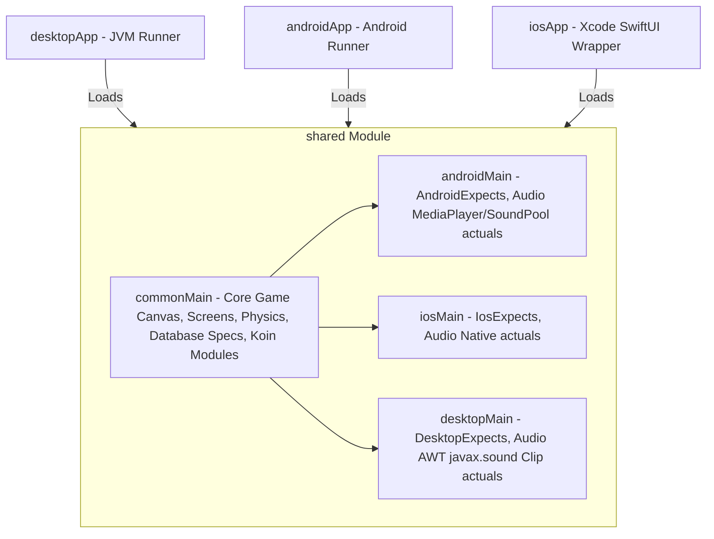

<p align="center">
  
</p>

<h1 align="center">Flying Bird</h1>

<p align="center">
  <b>A premium, high-performance, and beautifully styled Kotlin Multiplatform arcade game.</b><br>
  Running natively on Android, iOS, and Desktop (macOS, Windows, and Linux).
</p>

<p align="center">
  
  
  
  
</p>

---

## 📖 Table of Contents
1. [Overview](#-overview)
2. [Key Features](#-key-features)
3. [Architecture Design](#%EF%B8%8F-architecture-design)
4. [Technology Stack](#-technology-stack)
5. [Directory Layout](#-directory-layout)
6. [Platform Engineering Achievements](#-platform-engineering-achievements)
7. [Screenshots Showcase](#-screenshots-showcase)
8. [Setup & Running](#-setup--running)
9. [Author & License](#-author--license)

---

## 📝 Overview
**Flying Bird** is a premium cross-platform Kotlin Multiplatform (KMP) remake of the classic Flappy Bird game. Immersed in a **Dark Terminal / Cyberpunk** visual theme, it shares over 95% of its gameplay mechanics, collision math, database structures, resource loading, and UI templates across platforms. It serves as a showcase of sharing both UI layouts (via Jetbrains Compose Multiplatform) and business logic cleanly across Android, iOS, and Desktop targets.

---

## ✨ Key Features

### 🎮 Gameplay & Physics Engine
* **sine-wave Bobbing Startup:** Starts the game in a stationary "Get Ready" hover mode where the bird gently floats on a sine wave. Physics cycles, speed progression, and collision triggers begin only after the first flap, avoiding instant startup deaths.
* **Smooth Flight Interpolation:** Smooth bird pitch rotation transitions using linear interpolation (`lerp`) relative to velocity, removing visual jitter.
* **Difficulty Scaling:** Continuously increases obstacle scroll speeds and reduces top-to-bottom gap spacing based on active scores.
* **Diagonal Pipe Spawning:** Randomly introduces horizontal offsets on bottom obstacles starting at scores of 5 or more to increase game depth.

### 🎨 Visual Theme & Particle Systems
* **Theme-Specific Biomes:** Instantly loads 3 distinct themes (Default, Sunset, Winter) with matching backgrounds, base grounds, and obstacles.
* **Ambient Weather Effects:** Renders slanted rain drops for the Default theme, orange embers floating upward for the Sunset theme, and soft drifting snowflakes for the Winter theme.
* **Contrast Enhancements & Blur Filters:** Employs dimming shaders on sky backdrops to let the foreground elements stand out, applies saturation/contrast filters to game sprites, and blurs gameplay Canvas rendering behind active dialog overlays.

### 🎼 Continuous Audio Engine
* **Looping Background Tracks:** Looping background music plays seamlessly across restarts, menus, and gameplay states without interruptions.
* **Low-Latency SFX:** Playback triggers for wing flapping, obstacle hit, score point increment, player death, and menu swooshes.
* **Independent Controls:** Dual volume sliders configure music and sound effects volumes in real-time.

---

## 🛠️ Architecture Design
The project segregates core game logic and views into a shared KMP module, feeding native runner shells.



---

## 🛠️ Technology Stack

| Component | Technology | Version | Description |
| :--- | :--- | :--- | :--- |
| **Core Language** | Kotlin Multiplatform | `2.0.0` | Shared business and view layers across platforms. |
| **UI Framework** | Compose Multiplatform | `1.6.10` | Declarative UI rendering directly on canvas elements. |
| **State Management** | StateFlow & UI States | `Native` | Asynchronous local UI state encapsulation. |
| **Dependency Injection** | Koin | `3.5.3` | Multiplatform dependency injection container. |
| **Persistence** | SQLDelight | `2.0.2` | SQLite schema generators for settings and high scores. |
| **Android Audio** | MediaPlayer / SoundPool | `SDK` | Low-latency audio clip mixing and continuous looping. |
| **Desktop Audio** | AWT javax.sound | `JVM` | Direct audio line writing for Wav clips on JVM backends. |

---

## 📁 Directory Layout
```text
Flying Bird/
├── .github/                  # CI workflows, PR templates, and issue templates
├── androidApp/               # Android native application runner shell
│   └── src/main/AndroidManifest.xml
├── iosApp/                   # Xcode SwiftUI application runner shell
│   └── iosApp/iOSApp.swift
├── desktopApp/               # JVM Desktop runner shell
│   └── src/desktopMain/kotlin/Main.kt
├── shared/                   # KMP Core shared module
│   └── src/
│       ├── commonMain/       # Shared codebase (rendering, physics, DB, Koin, resources)
│       ├── androidMain/      # Android-specific actuals
│       ├── iosMain/          # iOS-specific actuals
│       └── desktopMain/      # Desktop-specific actuals
├── assets/                   # Screenshot galleries (desktop & mobile)
└── build.gradle.kts          # Top-level build configuration script
```

---

## 🚀 Platform Engineering Achievements

### 📱 Android Implementation
* **16KB Page Alignment:** Enabled legacy packaging configurations (`useLegacyPackaging = true`) to ensure seamless execution on next-generation Android devices using 16KB memory page alignments.
* **Universal APK builds:** Configured universal binary building to bundle all ABI formats within a single debug APK rather than split slices.
* **Edge-to-Edge Full Screen:** Implemented System Bar overlays that hide standard status/navigation bars and reveal them on swipe gestures.
* **Screen Locking:** Mapped orientation specifications directly in the manifest to sensor-based landscape orientation.

### 🍎 iOS Implementation
* **UIKit Orientation Locking:** Integrated custom SwiftUI `AppDelegate` interface overrides to restrict screen orientations to landscape formats.
* **CocoaPods & Frameworks:** Structured target link flags and frameworks to bundle shared libraries dynamically.

### 🖥️ Desktop (macOS, Windows, Linux) Implementation
* **Borderless Custom Frame:** Stripped OS headers by setting JVM frames to `undecorated = true`. Designed custom drag modifiers using mouse-relative coordinates to allow window drag movement, and custom title bars containing Close, Minimize, Maximize, and Fullscreen triggers.
* **Adaptive Fullscreen:** 
  * **macOS:** Implemented reflection-based event handlers targeting the `com.apple.eawt.FullScreenUtilities` APIs, dynamically entering native macOS Spaces while completely hiding system menu and dock bars.
  * **Windows & Linux:** Programmatically maximizes the undecorated frame boundaries to match screen sizes and sets the window to `alwaysOnTop = true` to cover OS taskbars.
* **Distribution Formats:** Configured native packaging generators to compile standalone Windows `.msi`/`.exe`, macOS `.dmg`/`.pkg`, and Linux `.deb`/`.rpm`/`.tar.gz`/`.tar.xz` installers.

---

## 📸 Screenshots Showcase

### 🖥️ Desktop UI Layouts
<table align="center">
  <tr>
    <td align="center"><b>Loading Screen</b></td>
    <td align="center"><b>Main Menu</b></td>
    <td align="center"><b>Settings Menu</b></td>
  </tr>
  <tr>
    <td></td>
    <td></td>
    <td></td>
  </tr>
  <tr>
    <td align="center"><b>Default Theme (Rain)</b></td>
    <td align="center"><b>Sunset Theme (Embers)</b></td>
    <td align="center"><b>Winter Theme (Snow)</b></td>
  </tr>
  <tr>
    <td></td>
    <td></td>
    <td></td>
  </tr>
  <tr>
    <td align="center"><b>Gameplay Screen</b></td>
    <td align="center"><b>Game Over Screen</b></td>
    <td align="center"></td>
  </tr>
  <tr>
    <td></td>
    <td></td>
    <td></td>
  </tr>
</table>

### 📱 Mobile UI Layouts
<table align="center">
  <tr>
    <td align="center"><b>Loading Screen</b></td>
    <td align="center"><b>Main Menu</b></td>
    <td align="center"><b>Settings Menu</b></td>
  </tr>
  <tr>
    <td></td>
    <td></td>
    <td></td>
  </tr>
  <tr>
    <td align="center"><b>Default Theme (Rain)</b></td>
    <td align="center"><b>Sunset Theme (Embers)</b></td>
    <td align="center"><b>Winter Theme (Snow)</b></td>
  </tr>
  <tr>
    <td></td>
    <td></td>
    <td></td>
  </tr>
  <tr>
    <td align="center"><b>Gameplay Screen</b></td>
    <td align="center"><b>Game Over Screen</b></td>
    <td align="center"></td>
  </tr>
  <tr>
    <td></td>
    <td></td>
    <td></td>
  </tr>
</table>

---

## ⚙️ Setup & Running

Ensure you have [Android Studio](https://developer.android.com/studio) or IntelliJ IDEA (with the Kotlin Multiplatform plugin installed) and **JDK 21** configured on your local machine.

### 🧪 1. Run Unit Tests
Run shared test suites checking physics behaviors, SQLDelight models, and settings state handlers:
```bash
./gradlew :shared:desktopTest
```

### 🖥️ 2. Run Desktop App
Launches the undecorated JVM window on your local machine:
```bash
./gradlew :desktopApp:run
```
* *Press `F11` in gameplay or click the `⛶` button to toggle borderless fullscreen modes.*

### 📱 3. Run Android App
Builds and installs the universal debug package directly to your connected device/emulator:
```bash
./gradlew :androidApp:installDebug
```

### 🍎 4. Run iOS App
1. Open the [iosApp/iosApp.xcodeproj](~/iosApp/iosApp.xcodeproj) project folder in Xcode.
2. Select a target iOS simulator or device.
3. Click the **Run** button or press `Cmd + R`.

---
*Created by Maheswara660. Happy flying!*
